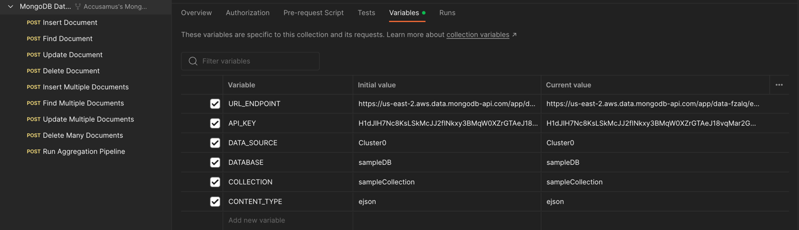
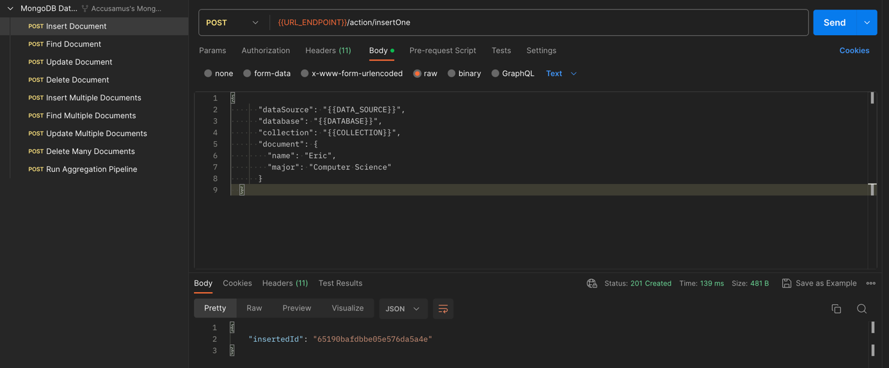
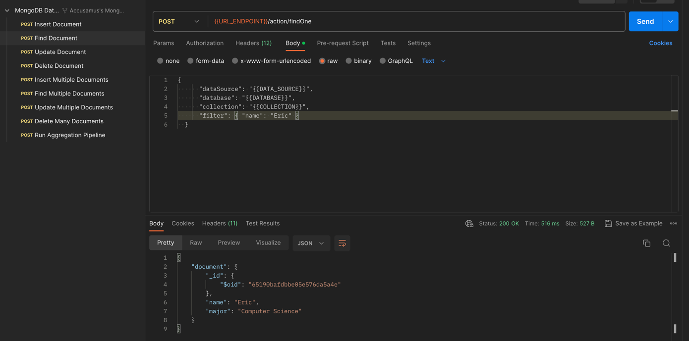
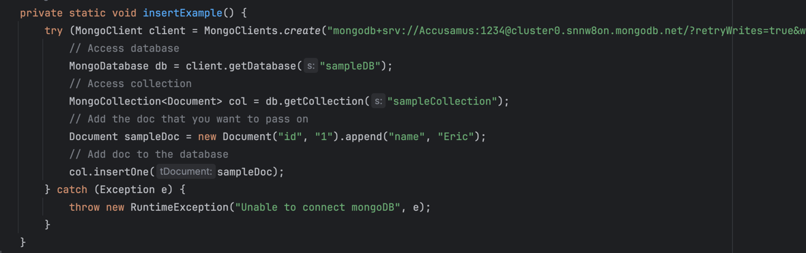
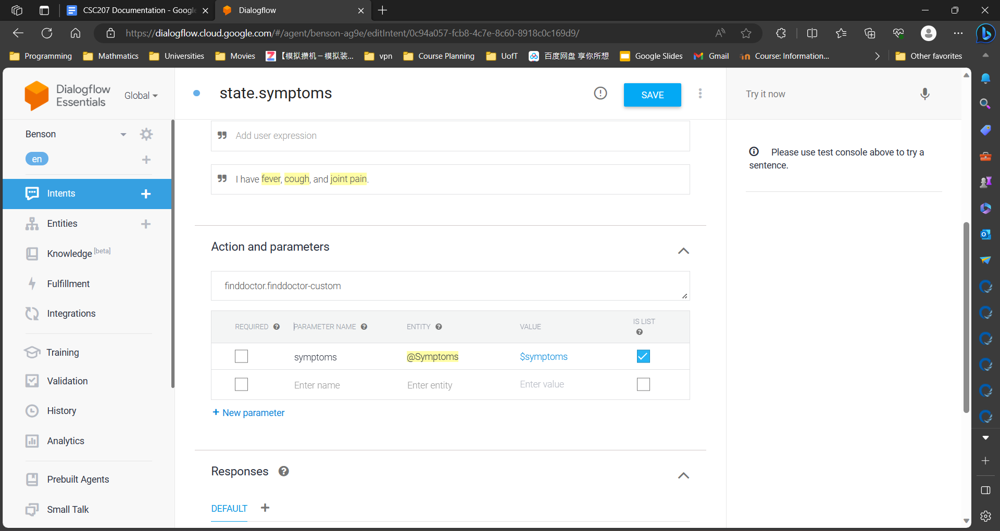
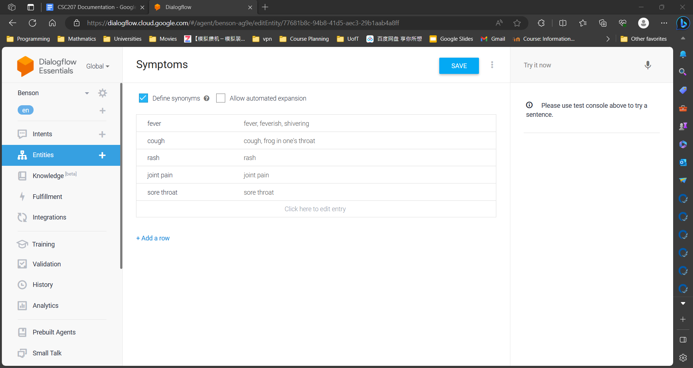
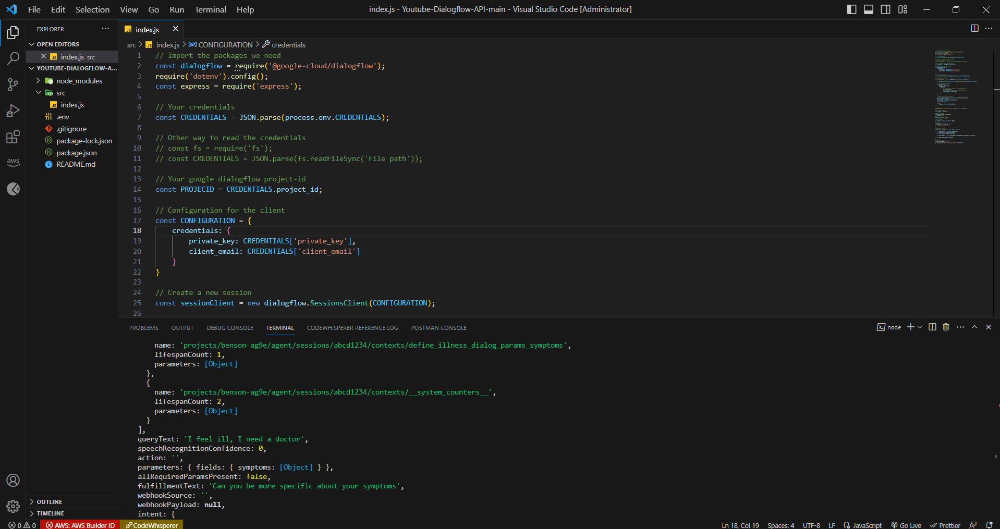
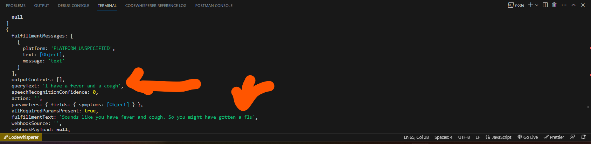
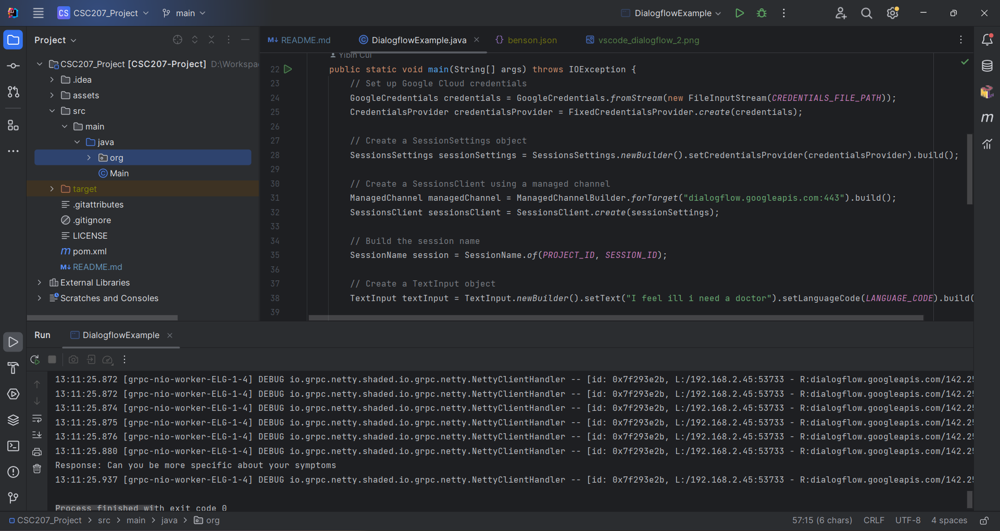

# CSC207-Project

Copyright © [2023] Marshal Guo, Yibin Cui, Dexter Tam, Riyad Valiyev, Jihyuk Yoon.

## Problem Domain

<!-- Problem Domain -->
Our problem domain lies in healthcare; we aim to build a website that simplifies the process of people looking for
treatments. Imagine, you are an adult in this modern world, you unfortunately hurt yourself or have gone ill. Where do
you find a doctor? Just like nobody taught you how to do taxes, you have no clue where to start. You start browsing on
government websites, yikes, wordy instructions and links that refer you elsewhere on the internet. Tired of it all, you
are almost about to give up and leave your discomfort unattended. BUT what if we tell you there is a universal website
that can find you a doctor in seconds? And that is where Benson (the name is still prone to change) comes in, a virtual
assistant that helps you find the right doc according to your symptoms in the pre-screening phase. Skipping having to
wait on a bench in the clinic with crying babies at your companion, you can talk to your healthcare professional
directly via messaging. And this isn't just limited to young adults, everyone who looks for more efficient and
accessible healthcare would get benefited from this website.

## Description

<!-- Description -->
Benson focuses on healthcare, specifically the establishment of the doctor-patient relationship when the patient is
trying to find the best doctor to treat their specific ailments and the simplification of the initial screening phase
as to enable ease of access to formal diagnosis and treatment.

The primary function of this project is to initiate and facilitate the simple healthcare access by providing
preliminary diagnosis for a patient via an API call to Dialogflow, a natural language processing model, in order to
identify symptoms and possible diseases, and then connecting them to a doctor who specializes in the areas that the
diseases are concerned with.

The application will have 3 primary stages:

1. Preliminary identification of the patient's symptoms and possible causes through Dialogflow.
2. Referral to a list of general practitioners or specialists in the relevant fields, from which the patient can then
   choose to receive treatment.
3. A chatting feature, including text, pictures, and video, between the doctor and patient to provide treatment.

Users and practitioners will be able to log in and out of the accounts, and basic user information will be stored via
MongoDB.

## APIs

Our team currently employs two APIs for this project: MongoDB Atlas and DialogFlow.

We will predominantly utilize MongoDB Atlas for data storage and querying purposes. This includes storing information
about available doctors and executing queries to identify suitable doctors based on a patient's symptom description. We
have chosen MongoDB Atlas for its user-friendly interface and streamlined operational efficiency.

Furthermore, we intend to implement an interactive chatbot using the DialogFlow API. When visitors access our website,
they will have the opportunity not only to peruse web content but also to engage in conversations with the chatbot. The
chatbot will facilitate the process of finding an appropriate doctor based on your symptoms, enabling you to take any
necessary actions accordingly.

Documentation for MongoDB Atlas and DialogFlow can be found in the following links:

1. [MongoDB Atlas](https://www.mongodb.com/docs/)
2. [DialogFlow](https://cloud.google.com/dialogflow/es/docs)

## Examples

### 1. MongoDB Atlas

The following three images demonstrate how Postman is used to invoke the MongoDB API.

The first image shows that the MongoDB public API is forked and filled with required information to ensure
our database can be accessed.

The second image illustrates how we used the insert method to add "Eric" to the database,
and the console returned a success message.

The third image demonstrates that a query method is used to retrieve the person named Eric from the database.

The following is a small snippet of Java code used to create an object in the database. After successful execution, it
added the data to the cloud-based database. This demonstrates that our MongoDB is functioning correctly.

### 2. DialogFlow

Dialogflow is an NLP tool that consists of features like intent recognition and entity extraction, and it also enables
more interactive and context-aware conversations between users and software. Specifically, intent means what the
user suggests the software should do, and entity means the keywords the software should pick out as data and
information. By adding the context attribute, we can connect intents to form a series of questions and responses to
better serve the client.

Unfortunately, Google has sunsetted conversational actions, so I couldn’t get my bearer token to make a request to
DialogFlow on third-party developing tools like Postman. Thus, I used JavaScript to make the query with my credentials.
As demonstrated, after the initial training of minimal data, our chatbot Benson can respond to making simple diagnoses
and finding doctors.

Finally, we tested out the API with Java, and everything worked pretty smoothly.

## Technical Issues

Since messaging is still a big part of our website, the core issue is to work out the architecture of the database
to store the messaging data, as well as how to update that in real time. In addition, we would also have to design two
interfaces, one for the patients and the other for the doctors. We could resort to using modular JavaScript libraries
like React.JS to efficiently achieve that. 

